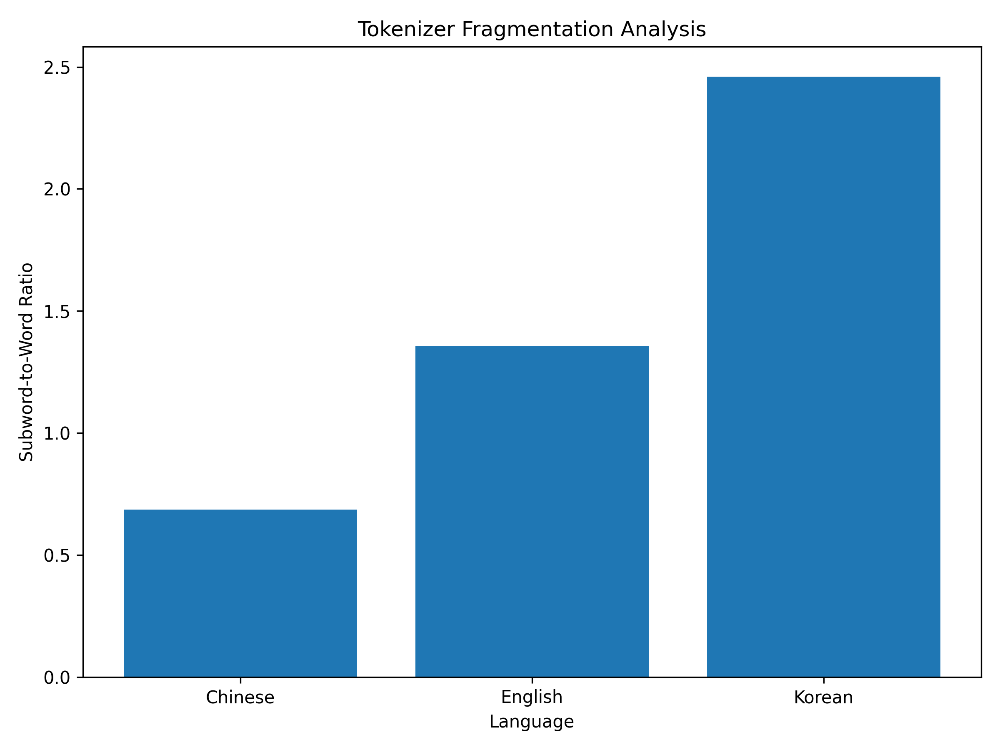
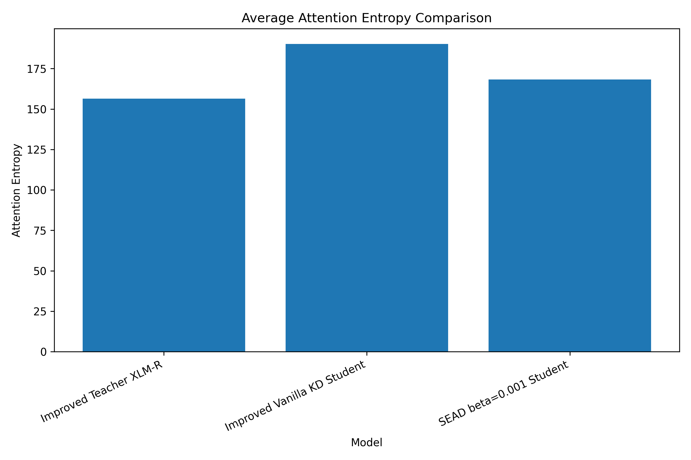

# SEAD: Soft Entropy Alignment Distillation for Korean Multilingual Transformers

This repository contains the course project implementation for:

**SEAD: Soft Entropy Alignment Distillation for Mitigating Cross-lingual Attention Collapse in Korean Multilingual Transformers**

The project investigates whether attention entropy alignment can help student multilingual Transformer models better preserve the attention behavior of a fine-tuned teacher model during knowledge distillation.

---

## 1. Project Overview

Large multilingual Transformer models such as XLM-RoBERTa achieve strong performance but are expensive to deploy. Knowledge distillation is a common method for transferring knowledge from a large teacher model to a smaller student model.

However, standard knowledge distillation mainly focuses on output logits and may not preserve the internal attention behavior of the teacher model. This project explores **Soft Entropy Alignment Distillation (SEAD)**, which adds an attention entropy alignment loss to encourage the student model to maintain attention entropy closer to the teacher.

The main task used in this project is **KLUE-NLI**.

---

## 2. Repository Structure

```text
261R0136COSE34102/
├── README.md
├── requirements.txt
├── src/
│   ├── load_data.py
│   ├── tokenizer_analysis.py
│   ├── train_student.py
│   ├── train_teacher.py
│   ├── train_teacher_improved.py
│   ├── train_vanilla_kd.py
│   ├── train_vanilla_kd_improved.py
│   ├── train_sead_beta0001.py
│   ├── analyze_attention_entropy.py
│   ├── plot_results.py
│   ├── compute_entropy.py
│   └── visualize_heatmap.py
├── experiments/
│   └── results/
│       ├── main_results.csv
│       ├── ablation_results.csv
│       ├── attention_entropy_analysis.csv
│       ├── tokenizer_analysis.csv
│       ├── main_results_bar_chart.png
│       ├── entropy_distance_bar_chart.png
│       └── ablation_beta_chart.png
└── paper/
    ├── draft.md
    └── references.bib
```

---

## 3. Installation

Install the required packages:

```bash
pip install -r requirements.txt
```

---

## 4. Dataset

This project uses the following datasets:

- KLUE-NLI
- KLUE-NER
- XNLI English
- XNLI Chinese

The datasets are automatically downloaded through the Hugging Face `datasets` library.

The dataset files themselves are not included in this repository.

---

## 5. Running the Experiments

### 5.1 Load datasets

```bash
python src/load_data.py
```

### 5.2 Tokenizer analysis

```bash
python src/tokenizer_analysis.py
```

This generates:

```text
experiments/results/tokenizer_analysis.csv
experiments/results/tokenizer_analysis_full.csv
```

### 5.3 Student baseline

```bash
python src/train_student.py
```

### 5.4 Improved teacher fine-tuning

```bash
python src/train_teacher_improved.py
```

### 5.5 Improved Vanilla Knowledge Distillation

```bash
python src/train_vanilla_kd_improved.py
```

### 5.6 SEAD beta=0.001

```bash
python src/train_sead_beta0001.py
```

### 5.7 Attention entropy analysis

```bash
python src/analyze_attention_entropy.py
```

### 5.8 Plot result figures

```bash
python src/plot_results.py
```

---

## 6. Main Results

| Method | Accuracy |
|---|---:|
| Student Fine-tuning | 0.352 |
| Vanilla KD | 0.372 |
| Improved Teacher XLM-R | 0.499 |
| Improved Vanilla KD | 0.547 |
| SEAD beta=0.001 | 0.544 |

The final SEAD model achieves accuracy close to Improved Vanilla KD while adding attention entropy alignment.

---

## 7. Attention Entropy Analysis

| Model | Accuracy | Attention Entropy | Entropy Distance to Teacher |
|---|---:|---:|---:|
| Improved Teacher XLM-R | 0.499 | 156.4763 | 0.0000 |
| Improved Vanilla KD Student | 0.547 | 190.1986 | 33.7223 |
| SEAD beta=0.001 Student | 0.544 | 168.3247 | 11.8484 |

Compared with Improved Vanilla KD, SEAD substantially reduces the attention entropy distance to the teacher while maintaining similar task accuracy.

---

## 8. SEAD Beta Ablation

| Method | Beta | Accuracy |
|---|---:|---:|
| SEAD | 0.1 | 0.360 |
| SEAD | 0.01 | 0.417 |
| SEAD | 0.001 | 0.544 |

A large entropy alignment weight harms classification performance. In the current experiments, beta=0.001 provides the best trade-off.

---

## 9. Result Figures

### Accuracy Comparison


### Tokenizer Fragmentation Analysis



### Raw Attention Entropy Comparison



### Attention Entropy Distance to Teacher


### SEAD Beta Ablation


---

## 10. Notes

The experiments are conducted on subsets of KLUE-NLI due to limited computational resources. Therefore, the results should be interpreted as small-scale experimental evidence rather than full benchmark performance.

Model checkpoints are not uploaded to this repository because they are large. The repository includes source code, result files, and figures for reproducibility.
